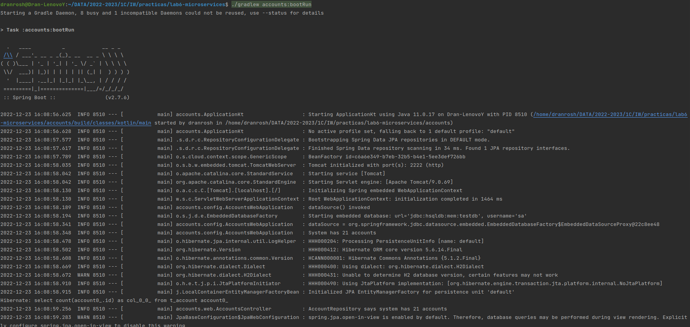
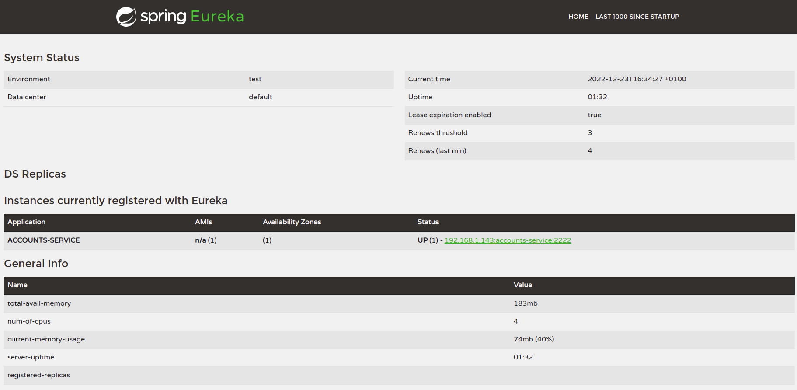

# Lab 6 report

## Tasks

 - Launch service registration server on port 1111 (Eureka Server).
 - Launch `accounts` and `web` services on ports 2222 and 3333 respectively.
 - Launch another `accounts` service on port 4444 and check registration on Eureka server.
 - Kill `accounts` service on port 2222. What happens when try to make a request to the `web`? Why?

## Eureka server

First of all we need to launch the service registration server on port 1111.

Once it's running, let's check it on the web browser

## Accounts service

Now that the Eureka server is up, we can launch the `accounts` service

Let's check now if it's in the registration server

Everything seems to work fine.
## Web service

And finally we may launch the `web` service.

## Launching additional service

We want to try now what happens when you launch another `accounts` service on port 4444.

We can see both services are registered on ports 2222 and 4444 respectively.

## Killing one of the services

We want to know if the web is going to work even if we kill the first `accounts` service (port 2222). 
In order to do that, we kill the service process `Ctrl`+`C`. And do a request to the web.

### Why?

If at least one `accounts` service is running, it doesn't matter on which port it's being launched as long as it's registered.
Eureka server will tell `web` service where to find it.

